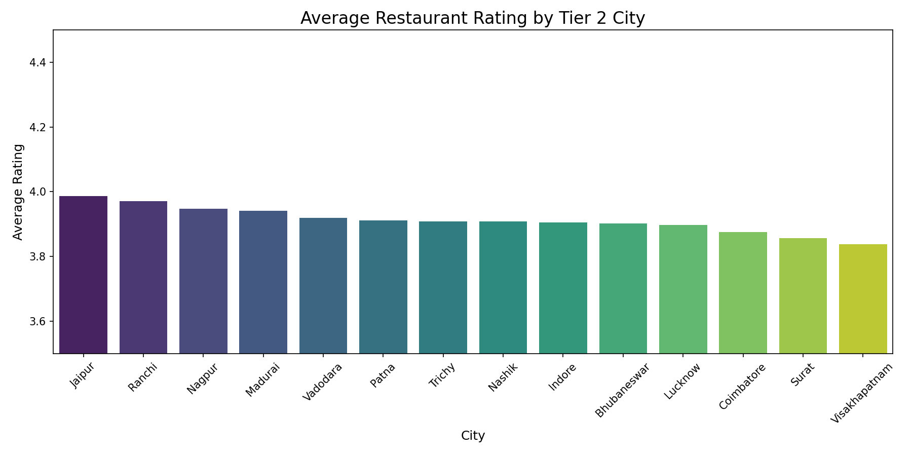
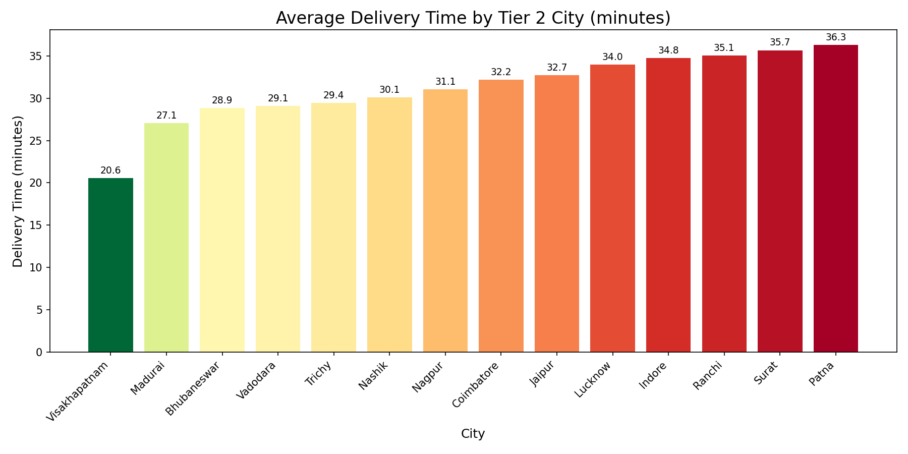
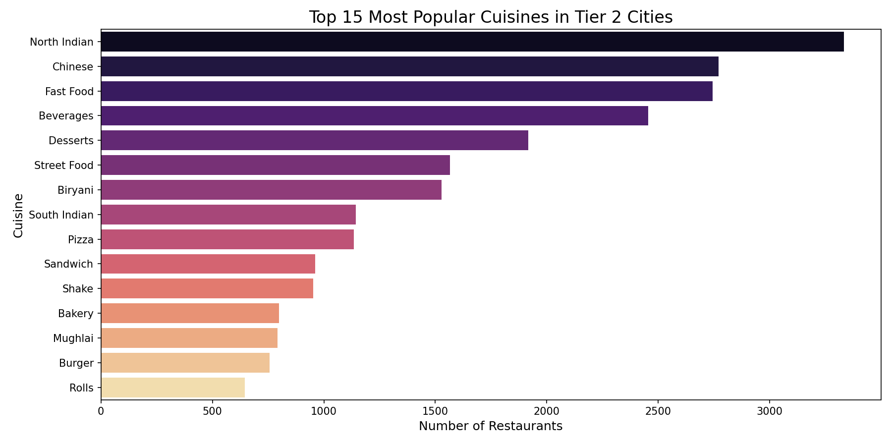
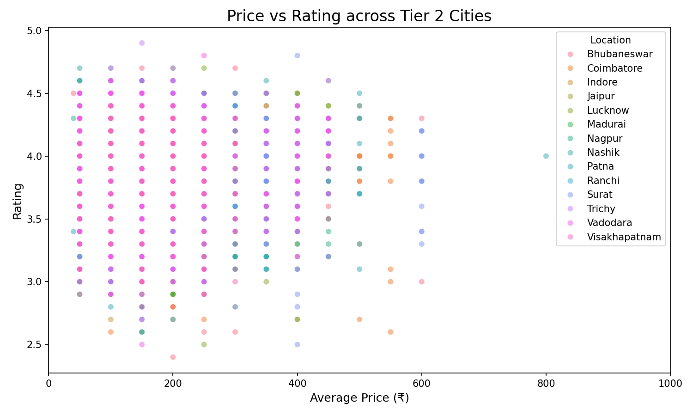

# Tier 2 India Food Delivery Analysis
---

## Why This Project?

Food delivery analysts always focus on Mumbai, Bangalore, Delhi. 
But India's real growth story is happening in Tier 2 cities — 
places like Coimbatore, Jaipur, Visakhapatnam. I analysed 43,307 
restaurants across 14 Tier 2 cities to find what everyone else is missing.

---

## Key Findings

| Finding | Result |
|---|---|
| Best Value City | Visakhapatnam — fastest delivery, good ratings, lowest prices |
| Highest Rated City | Jaipur — average rating 3.99 |
| Price vs Quality | Correlation 0.01 — price does NOT predict quality |
| Biggest Market Gap | Vadodara — only 6.28% South Indian restaurants |
| ML Model | 57% accuracy — quality beats operational metrics |

---

## Business Recommendations

- Zomato should prioritise Visakhapatnam for premium partnerships
- South Indian chains should expand to Vadodara and Nagpur first  
- New restaurants need not invest in premium pricing — quality matters more
- Benchmark Visakhapatnam delivery operations across all Tier 2 cities

---

## Visual Analysis

---

## Tools Used

| Category | Tools |
|---|---|
| Language | Python |
| Data Analysis | Pandas, NumPy |
| Visualisation | Matplotlib, Seaborn, Plotly |
| Machine Learning | Scikit-learn, Gradient Boosting |
| Environment | Google Colab |

---

## Dataset
Zomato Top 100 Cities Dataset — Kaggle | 43,307 restaurants | 14 cities

---

## Conclusion

Tier 2 India is significantly underanalysed. This project shows that 
the food delivery opportunity outside metro cities is real, measurable, 
and full of gaps that smart businesses can fill. Price alone cannot buy 
success — quality and speed matter more.
